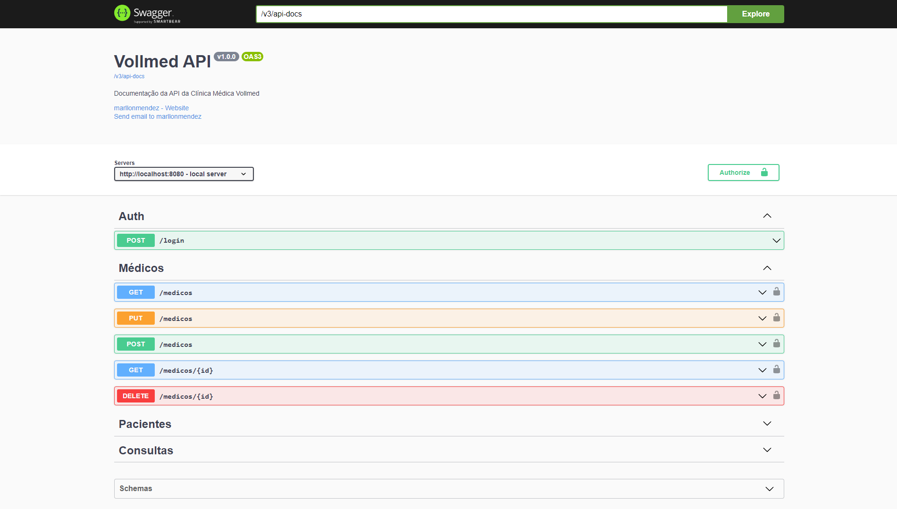

# Vollmed API

## Sobre
A Vollmed API é um API REST para uma clínica médica fictícia, desenvolvida para fins educacionais. Este projeto abrange conceitos como migrações de banco de dados, tratamento de exceções, autenticação usando JWT, filtros em requisições, validações personalizadas e documentação do Swagger.

## Funcionalidades

### Usuário

- Efetuar login com autenticação JWT.

### Médico

- Cadastro de médicos.
- Listagem de todos os médicos disponíveis.
- Visualização detalhada de um médico.
- Atualização dos dados de um médico.
- Remoção de médicos.

### Paciente

- Cadastro de pacientes.
- Listagem de todos os pacientes disponíveis.
- Visualização detalhada de um paciente.
- Atualização dos dados de um paciente.
- Remoção de pacientes.

### Consulta

- Agendamento de consultas.
- Listagem de todas as consultas disponíveis.
- Cancelamento de consultas.

## Licença

Este projeto está licenciado sob a [Licença MIT](LICENSE).